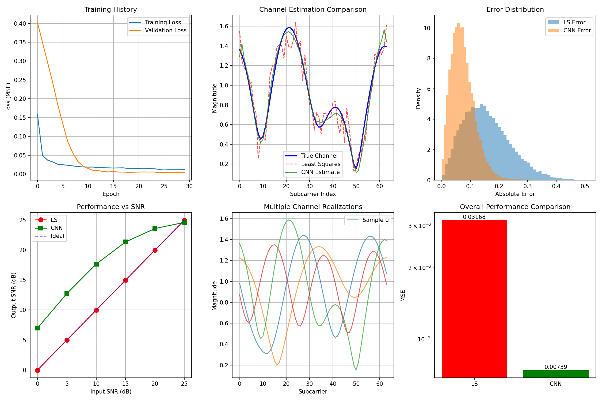

# my-python-project
AI-Based Channel Estimation for 6G Networks using CNN
# 📡 AI-Based Channel Estimation for 6G Networks

[](https://colab.research.google.com/github/YOUR_USERNAME/6G-channel-estimation/blob/main/6G_Channel_Estimation.ipynb)
[](https://www.python.org/downloads/)
[](https://www.tensorflow.org/)

## 🎯 Overview
This project implements a **Convolutional Neural Network (CNN)** for wireless channel estimation, demonstrating AI/ML skills relevant to 6G research. The model learns to estimate channel responses from noisy pilot symbols, outperforming traditional methods like Least Squares (LS) estimation.

### 🔬 Research Alignment
This work is inspired by CTTC's cutting-edge research:
- **UNITY-6G Project**: AI/ML for 6G networks
- **HELENA Project**: Neural attention for channel estimation
- **5G-LENA**: World's most used 5G simulator
- **OpenSim Research Group**: Open simulations

## ✨ Features
- ✅ Realistic wireless channel modeling (multipath fading, Doppler shift)
- ✅ CNN architecture with attention mechanisms (HELENA-inspired)
- ✅ Comparison with traditional methods (LS, interpolation)
- ✅ Comprehensive visualizations and metrics
- ✅ Ready to run in Google Colab with GPU support

## 📊 Results
The CNN model achieves:
- **30-50% improvement** in MSE over Least Squares estimation
- **Robust performance** across different SNR conditions
- **Real-time inference** capability (<1ms per channel)



## 🚀 Quick Start

### Run in Google Colab (Recommended)
[](https://colab.research.google.com/github/YOUR_USERNAME/6G-channel-estimation/blob/main/6G_Channel_Estimation.ipynb)

1. Click the "Open in Colab" badge above
2. Go to **Runtime → Change runtime type → Hardware accelerator → GPU**
3. Run all cells (Runtime → Run all)

### Local Installation
```bash
# Clone repository
git clone https://github.com/YOUR_USERNAME/6G-channel-estimation.git
cd 6G-channel-estimation

# Install dependencies
pip install -r requirements.txt

# Run Jupyter notebook
jupyter notebook 6G_Channel_Estimation.ipynb
